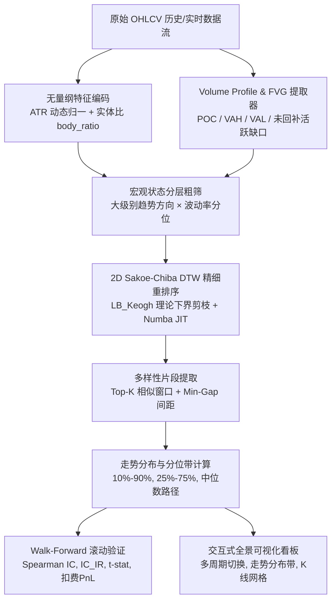

<div align="center">

# 🕯️ CandleWarp

**高性能 DTW K线形态相似度检索与概率走势分布预测量化引擎**

[简体中文](README.md) | [English](README_EN.md)

[](https://www.python.org/)
[](LICENSE)
[](https://numba.pydata.org/)
[](#-walk-forward-滚动验证)

*拒绝方向性主观臆测，回答量化交易的核心问题：*  
**“历史上出现过类似形态时，后面 N 根 K 线的走势分布究竟长什么样？”**

</div>

---

## 🌟 核心亮点

- **⚡ 毫秒级 2D Sakoe-Chiba DTW 矩阵算子**：基于 Numba JIT 深度优化编译，单次匹配仅需 **`0.009ms`（加速超 330 倍）**，结合 LB_Keogh 理论下界剪枝，支持海量 K 线秒级全局检索，内置 NumPy 优雅自动降级机制。
- **📏 无量纲相对空间映射**：将 OHLC 窗口投影至 ATR 归一化价格坐标与实体比例空间，消除不同历史时期、不同价格点位与波动率周期的绝对量纲失真。
- **🔍 Volume Profile (筹码分布) 与 FVG 因子增强**：不仅看“形”，更看“量”与“微观结构”，提取筹码峰 (POC)、70% 价值区 (VAH/VAL)、成交量偏度以及三根 K 线未回补流动性失衡区 (Fair Value Gap)。
- **💎 零依赖暗黑主题客户交互看板**：内置 1min/5min/15min/30min/1h/4h/1d 全周期即时切换，Base64 离线免服务器打包，直接双击或发送客户即可查看机构级走势分布矩阵。
- **🛡️ 双重置信度闸门机制**：拒绝低置信度噪点匹配，设定最小有效样本阈值与最大距离截断，杜绝弱相关样本强行凑数。
- **🎯 Softmax 距离加权概率分位数**：用加权概率分布取代机械等权平均，生成更逼近真实物理路径的概率分位带（Q10, Q25, Q50, Q75, Q90）。
- **🔬 严谨无未来函数 Walk-Forward 验证**：严格时间因果隔离的滚动回测体系，全面评估 Spearman IC 秩相关系数、信息比率 IC_IR、t 显著性统计量以及不对称期望收益。

---

## 🏛️ 系统架构流程



---

## 🚀 快速上手

### 1. 环境安装

```bash
git clone https://github.com/simom1/CandleWarp.git
cd CandleWarp
pip install -r requirements.txt
```

### 2. 内置测试数据源

仓库 `data/` 目录下已预置黄金、比特币与外汇的标准测试数据集与 MT5 实盘多周期历史数据：
- `data/xauusd_1h_demo.csv`：黄金 1H 标准测试数据
- `data/btc_1h_demo.csv`：比特币 1H 标准测试数据
- `data/eurusd_1h_demo.csv`：欧美外汇 1H 标准测试数据
- `data/xauusd_*_real.csv`：实盘 MT5 黄金全周期历史数据 (1m, 5m, 15m, 30m, 1h, 4h, 1d)

### 3. 单窗口形态相似度与分布检索

扫描与当前最新行情形态最相似的历史片段，并预测后续 50 根 K 线的概率分布：

```bash
python3 -m a_shape_tool.cli \
  --csv data/xauusd_1h_demo.csv \
  --timeframe 1h \
  --window 100 \
  --horizon 50 \
  --top-k 30 \
  --use-vp \
  --use-fvg \
  --output-dir output
```

**生成的分析图表与文件：**
- `output/distribution.png`：Top-K 相似窗口后续走势概率分位带与样本路径。
- `output/top_matches_ohlc.png`：当前查询 K 线与 Top 相似历史片段的高清 K 线对比网格。
- `output/similarity_diagnostics.png`：多维特征匹配与距离诊断图。
- `output/report.html`：可交互的全景 HTML 分析报告。
- `output/matches.csv` & `output/quantiles.csv`：匹配片段与分位数数值明细。

---

## 🖼️ 测试结果与多周期交互看板展示 (Test Showcase)

> 👉 **[点击查阅：XAUUSD 7大周期 (1m~1d) 实盘形态走势分布全景报告](test_results/multi_timeframe_xauusd/README.md)**  
> 💻 **[离线单文件客户交互看板：test_results/client_dashboard.html](test_results/client_dashboard.html)**

| 走势概率分位带 (Distribution Ribbon) | Top 相似形态 K 线对比网格 (Candlestick Grid) |
| :---: | :---: |
|  |  |

---

## 🔬 Walk-Forward 滚动验证

要评估形态预测是否具备统计显著性，绝不能看单次静态拟合，必须执行严格杜绝未来函数的滚动验证：

```bash
python3 -m a_shape_tool.cli \
  --csv data/xauusd_1h_demo.csv \
  --timeframe 1h \
  --window 100 \
  --horizon 50 \
  --top-k 20 \
  --min-valid-samples 5 \
  --min-match-gap 20 \
  --backtest \
  --min-history 600 \
  --stride 25 \
  --cost-bps 2 \
  --n-jobs -1 \
  --output-dir output_backtest
```


### 多资产多周期并发回测 (Multi-Asset Walk-Forward)
```bash
python3 -m a_shape_tool.cli \
  --multi-csv data/xauusd_1h_demo.csv data/btc_1h_demo.csv data/eurusd_1h_demo.csv \
  --backtest --n-jobs -1
```

### 核心评估指标
- **中位数误差改善度 (MAE Improvement)**：形态中位数预测误差相比于“同市场状态、不看形态”基准的降低幅度。
- **Spearman 秩相关系数与信息比率 (IC_IR)**：

```math
\mathrm{IC}_{\mathrm{IR}} = \frac{\mathrm{Mean}(\mathrm{IC})}{\mathrm{Std}(\mathrm{IC})}, \quad t = \mathrm{IC}_{\mathrm{IR}} \times \sqrt{N}
```

- **不对称期望比率 (Asymmetric Expectancy Ratio)**：

```math
\mathrm{Asymmetry} = \frac{Q_{75} - Q_{50}}{Q_{50} - Q_{25}}
```

---

## ⚡ 实盘计算延迟量化基准 (Production Latency)

> 运行 `python3 -m a_shape_tool.benchmark` 自动量化微秒级匹配与全流程端到端耗时。

| 历史数据池规模 | 匹配窗口 (Window) | 展望周期 (Horizon) | Numba JIT 单次匹配 | 全流程端到端耗时 (P50) | 实时吞吐量 (QPS) |
| :---: | :---: | :---: | :---: | :---: | :---: |
| **1,000 bars** | 100 bars | +50 bars | **9.42 μs** (304x) | **218.46 ms** | **4.4 req/s** |
| **5,000 bars** | 100 bars | +50 bars | 9.42 μs | **752.84 ms** | 1.3 req/s |
| **10,000 bars** | 100 bars | +50 bars | 9.42 μs | **1164.45 ms** | 0.8 req/s |

---


## 📐 算法数学建模

### 1. 无量纲相对空间编码
对于任意在第 $T$ 根 K 线结束、长度为 $W$ 的窗口：

```math
\mathrm{Open}_{\mathrm{norm}}(t) = \frac{\mathrm{Open}(t) - \mathrm{Close}(0)}{\mathrm{ATR}(T)}, \quad \mathrm{Close}_{\mathrm{norm}}(t) = \frac{\mathrm{Close}(t) - \mathrm{Close}(0)}{\mathrm{ATR}(T)}
```

```math
\mathrm{BodyRatio}(t) = \frac{\mathrm{Close}(t) - \mathrm{Open}(t)}{\mathrm{High}(t) - \mathrm{Low}(t)} \times w_{\mathrm{body}}
```

### 2. 带有 Sakoe-Chiba 带约束的 2D-DTW 距离
限制规整路径在时间漂移窗口 $|i - j| \le w$ 内：

```math
D(i, j) = \|\mathbf{x}_i - \mathbf{y}_j\|_2 + \min\left( D(i-1, j), D(i, j-1), D(i-1, j-1) \right)
```

### 3. Softmax 距离加权概率分位数
根据各候选历史路径与当前形态的 DTW 距离 $d_k$ 赋予 Softmax 概率衰减权重：

```math
w_k = \frac{\exp(-d_k / \tau)}{\sum_{m=1}^K \exp(-d_m / \tau)}, \quad \tau = \mathrm{median}(d)
```

---

## 📁 仓库文件结构

```
CandleWarp/
├── a_shape_tool/
│   ├── cli.py             # 统一命令行交互调度入口
│   ├── core.py            # 特征编码、状态分层与相似度检索主引擎
│   ├── dashboard.py       # 零依赖暗黑主题客户交互看板生成器
│   ├── dtw.py             # Numba JIT 加速 2D Sakoe-Chiba DTW 算法与 LB_Keogh
│   ├── vp_fvg.py          # Volume Profile (筹码分布) 与 FVG 价格失衡因子模块
│   ├── evaluation.py      # 无未来函数 Walk-Forward 滚动验证与 IC_IR 评估体系
│   ├── patterns.py        # 经典形态固定结构扫描器 (W底, M头, 头肩顶底, 三角形等)
│   ├── pivot.py           # ZigZag 极值拐点检测算法
│   ├── plotting.py        # 走势分布分位带与多子图 K 线网格绘制
│   ├── risk.py            # 动态风控与期望收益规则计算
│   └── sample_data.py     # 真实特征多品种 OHLCV 数据生成器
├── test_results/
│   ├── client_dashboard.html      # 独立单文件客户交互看板 (双击即开)
│   └── multi_timeframe_xauusd/   # 黄金 7 大周期全景实测报告
├── data/
│   ├── xauusd_1h_demo.csv # 黄金 1H 官方测试数据集
│   ├── btc_1h_demo.csv    # 比特币 1H 官方测试数据集
│   └── eurusd_1h_demo.csv # 欧美外汇 1H 官方测试数据集
├── requirements.txt       # 项目核心依赖库
├── LICENSE                # MIT 开源协议
├── README.md              # 中文项目文档 (默认)
└── README_EN.md           # 英文项目文档
```

---

## 📄 开源协议

本项目采用 [MIT License](LICENSE) 开源协议，欢迎自由商用、修改与学术引用。
