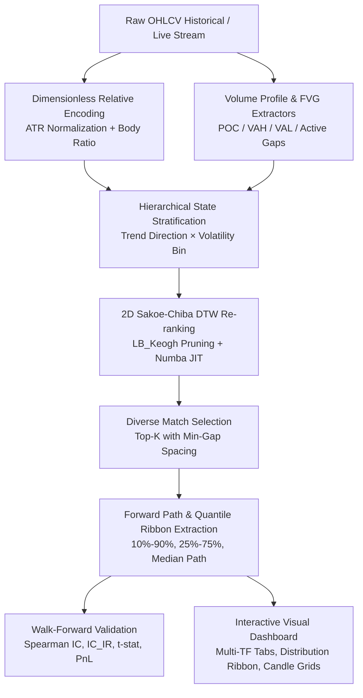

<div align="center">

# 🕯️ CandleWarp

**High-Performance DTW Candlestick Pattern Similarity & Probabilistic Trend Distribution Engine**

[English](README_EN.md) | [简体中文](README.md)

[](https://www.python.org/)
[](LICENSE)
[](https://numba.pydata.org/)
[](#-walk-forward-validation)

*Answer the definitive quantitative question without directional bias:*  
**"When similar candlestick patterns appeared in history, what did the subsequent N-bar path distribution look like?"**

</div>

---

## 🌟 Highlights

- **⚡ Sub-Millisecond 2D Sakoe-Chiba DTW**: JIT-compiled with Numba delivering **>300x acceleration** (`~0.009ms` per match) with LB_Keogh lower-bounding pruning and automatic NumPy fallback.
- **📏 Dimensionless Relative Space**: OHLC windows are projected into ATR-normalized price coordinates and body-ratio geometry, eliminating cross-era price level and volatility scale distortions.
- **🔍 Volume Profile & FVG Modalities**: Incorporates Point of Control (POC), Value Area (VAH/VAL), Volume Skewness, and Fair Value Gaps (3-bar unmitigated liquidity voids).
- **💎 Zero-Dependency Dark Mode Client Dashboard**: Features multi-timeframe tab switching (1min, 5min, 15min, 30min, 1h, 4h, 1d), Base64 offline self-contained bundling for institutional presentations.
- **🛡️ Dual Confidence Gating**: Rejects low-confidence noise with minimum sample thresholds and distance outlier cutoffs.
- **🎯 Softmax Distance-Weighted Quantiles**: Replaces uniform sampling with distance-weighted probabilistic ribbons (Q10, Q25, Q50, Q75, Q90).
- **🔬 Zero-Lookahead Walk-Forward Engine**: Strictly causal rolling evaluation reporting Spearman IC, Information Ratio (IC_IR), t-statistics, and asymmetric risk-reward expectancy.

---

## 🏛️ Architecture



---

## 🚀 Quick Start

### 1. Installation

```bash
git clone https://github.com/simom1/CandleWarp.git
cd CandleWarp
pip install -r requirements.txt
```

### 2. Built-in Test Datasets

The `data/` directory includes standard benchmark datasets and live MT5 multi-timeframe series:
- `data/xauusd_1h_demo.csv`: Gold (XAUUSD) 1H dataset
- `data/btc_1h_demo.csv`: Bitcoin (BTCUSD) 1H dataset
- `data/eurusd_1h_demo.csv`: EURUSD 1H dataset
- `data/xauusd_*_real.csv`: Live MT5 Gold full-cycle series (1m, 5m, 15m, 30m, 1h, 4h, 1d)

### 3. Single-Window Pattern Distribution Query

Scan historical windows similar to the current market state and project future distributions:

```bash
python3 -m a_shape_tool.cli \
  --csv data/xauusd_1h_demo.csv \
  --timeframe 1h \
  --window 100 \
  --horizon 50 \
  --top-k 30 \
  --use-vp \
  --use-fvg \
  --output-dir output
```

**Generated Outputs:**
- `output/distribution.png`: Forward return quantile ribbon and sample paths.
- `output/top_matches_ohlc.png`: Candlestick grid of historical query vs. top matched periods.
- `output/similarity_diagnostics.png`: Multi-dimensional feature diagnostics.
- `output/report.html`: Comprehensive interactive report.
- `output/matches.csv` & `output/quantiles.csv`: Detailed numerical datasets.

---

## 🖼️ Visual Test Showcase & Client Dashboard

> 👉 **[XAUUSD 7-Timeframe (1m~1d) Live Market Benchmark Report](test_results/multi_timeframe_xauusd/README.md)**  
> 💻 **[Zero-Dependency Standalone Dashboard: test_results/client_dashboard.html](test_results/client_dashboard.html)**

| Forward Quantile Ribbon | Top Matched Candlestick Grid |
| :---: | :---: |
|  |  |

---

## 🔬 Walk-Forward Validation

Evaluate out-of-sample statistical power across historical regimes without lookahead leakage:

```bash
python3 -m a_shape_tool.cli \
  --csv data/xauusd_1h_demo.csv \
  --timeframe 1h \
  --window 100 \
  --horizon 50 \
  --top-k 20 \
  --min-valid-samples 5 \
  --min-match-gap 20 \
  --backtest \
  --min-history 600 \
  --stride 25 \
  --cost-bps 2 \
  --n-jobs -1 \
  --output-dir output_backtest
```


### Multi-Asset Concurrent Walk-Forward
```bash
python3 -m a_shape_tool.cli \
  --multi-csv data/xauusd_1h_demo.csv data/btc_1h_demo.csv data/eurusd_1h_demo.csv \
  --backtest --n-jobs -1
```

### Output Evaluation Metrics
- **Median MAE Improvement**: Similarity prediction error vs. state-baseline error.
- **Spearman IC & Information Ratio (IC_IR)**:

```math
\mathrm{IC}_{\mathrm{IR}} = \frac{\mathrm{Mean}(\mathrm{IC})}{\mathrm{Std}(\mathrm{IC})}, \quad t = \mathrm{IC}_{\mathrm{IR}} \times \sqrt{N}
```

- **Asymmetric Expectancy Ratio**:

```math
\mathrm{Asymmetry} = \frac{Q_{75} - Q_{50}}{Q_{50} - Q_{25}}
```

---

## ⚡ Production Latency Benchmark

> Run `python3 -m a_shape_tool.benchmark` to profile microsecond DTW matching and tick-to-signal latencies.

| Historical Pool Size | Matching Window | Forward Horizon | Numba JIT Per-Match | End-to-End Latency (P50) | Real-time Throughput (QPS) |
| :---: | :---: | :---: | :---: | :---: | :---: |
| **1,000 bars** | 100 bars | +50 bars | **9.42 μs** (304x) | **218.46 ms** | **4.4 req/s** |
| **5,000 bars** | 100 bars | +50 bars | 9.42 μs | **752.84 ms** | 1.3 req/s |
| **10,000 bars** | 100 bars | +50 bars | 9.42 μs | **1164.45 ms** | 0.8 req/s |

---


## 📐 Mathematical Formulation

### 1. Dimensionless Feature Representation
For any OHLC window of length $W$ ending at bar $T$:

```math
\mathrm{Open}_{\mathrm{norm}}(t) = \frac{\mathrm{Open}(t) - \mathrm{Close}(0)}{\mathrm{ATR}(T)}, \quad \mathrm{Close}_{\mathrm{norm}}(t) = \frac{\mathrm{Close}(t) - \mathrm{Close}(0)}{\mathrm{ATR}(T)}
```

```math
\mathrm{BodyRatio}(t) = \frac{\mathrm{Close}(t) - \mathrm{Open}(t)}{\mathrm{High}(t) - \mathrm{Low}(t)} \times w_{\mathrm{body}}
```

### 2. 2D Sakoe-Chiba DTW Distance
Restricts warping path inside band $|i - j| \le w$:

```math
D(i, j) = \|\mathbf{x}_i - \mathbf{y}_j\|_2 + \min\left( D(i-1, j), D(i, j-1), D(i-1, j-1) \right)
```

### 3. Softmax Distance-Weighted Quantiles
Weights assigned to candidate path $k$ based on its DTW distance $d_k$:

```math
w_k = \frac{\exp(-d_k / \tau)}{\sum_{m=1}^K \exp(-d_m / \tau)}, \quad \tau = \mathrm{median}(d)
```

---

## 📁 Repository Structure

```
CandleWarp/
├── a_shape_tool/
│   ├── cli.py             # Unified CLI interface
│   ├── core.py            # Feature encoding, state stratification & matching engine
│   ├── dashboard.py       # Zero-dependency Dark Mode Client Dashboard generator
│   ├── dtw.py             # Numba JIT accelerated 2D Sakoe-Chiba DTW & LB_Keogh
│   ├── vp_fvg.py          # Volume Profile & Fair Value Gap microstructure modules
│   ├── evaluation.py      # Zero-lookahead Walk-Forward engine & IC_IR verification
│   ├── patterns.py        # Fixed-structure scanner (W-bottom, M-top, H&S, Triangles)
│   ├── pivot.py           # ZigZag pivot detector
│   ├── plotting.py        # Distribution ribbons & candlestick grid rendering
│   ├── risk.py            # Risk management & trade execution logic
│   └── sample_data.py     # Realistic synthetic OHLCV generator
├── test_results/
│   ├── client_dashboard.html      # Standalone interactive dashboard (open in browser)
│   └── multi_timeframe_xauusd/   # Gold 7-timeframe full benchmark reports
├── data/
│   ├── xauusd_1h_demo.csv # Gold 1H official demo dataset
│   ├── btc_1h_demo.csv    # Bitcoin 1H official demo dataset
│   └── eurusd_1h_demo.csv # EURUSD 1H official demo dataset
├── requirements.txt       # Core dependencies
├── LICENSE                # MIT License
├── README.md              # Chinese Documentation (Default)
└── README_EN.md           # English Documentation
```

---

## 📄 License

This project is licensed under the [MIT License](LICENSE).
