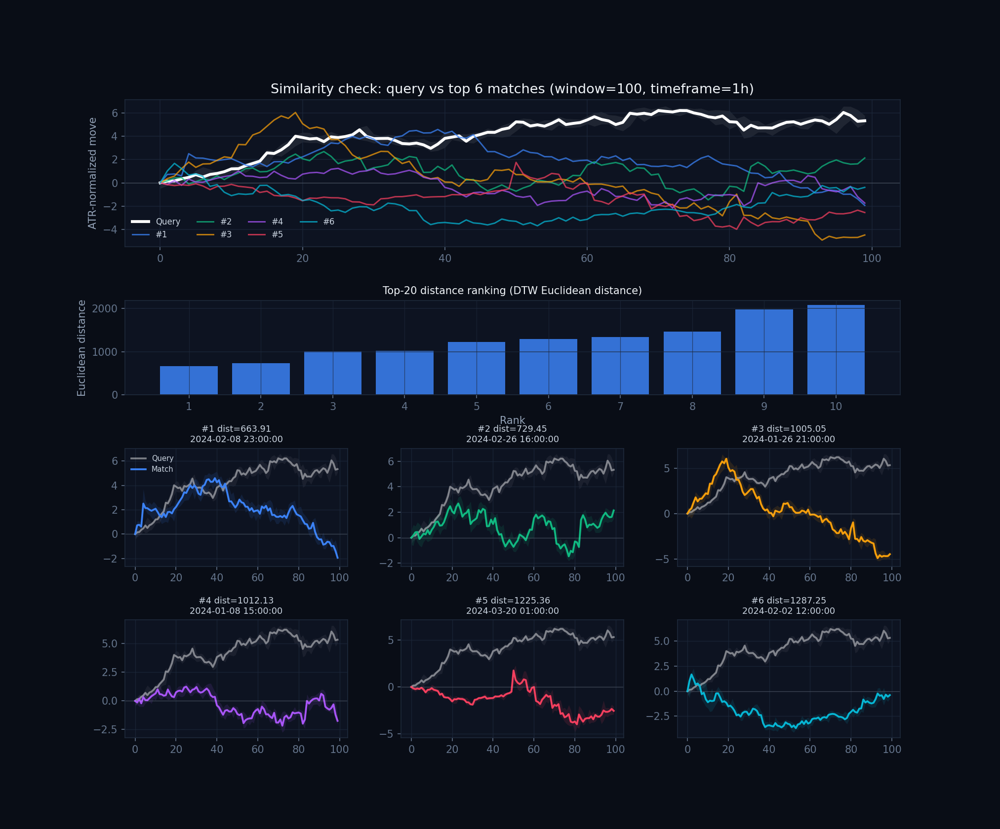
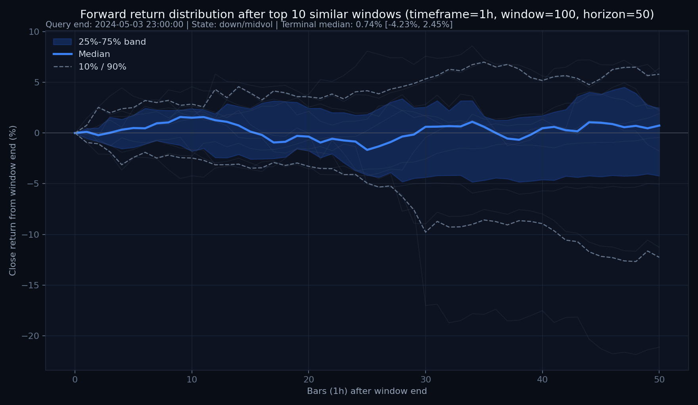
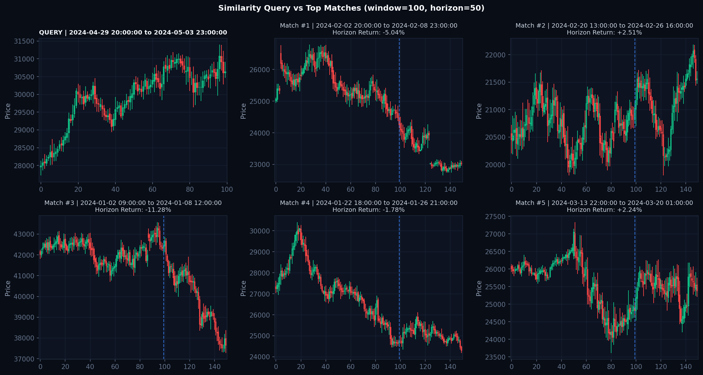

# 📊 CandleWarp 测试结果与图表展示 (Test Results & Visual Showcase)

本目录展示了使用 **`CandleWarp`** 对内置标准测试数据集与 **MT5 实盘多周期黄金 (XAUUSD 1m/5m/15m/30m/1h/4h/1d)** 进行形态相似度匹配、走势分布预测与量化延迟评估的实际输出。

> 👉 **[XAUUSD 7大周期 (1m~1d) 实盘形态走势分布全景报告](multi_timeframe_xauusd/README.md)**  
> ⚡ **[实盘计算延迟与 305x JIT 加速量化基准测试报告](latency_benchmark.md)**  
> 💻 **[独立单文件客户交互看板：client_dashboard.html](client_dashboard.html)**

---


## 🪙 1. 黄金测试结果 (XAUUSD 1H Test Results)

### A. 相似形态走势分布分位带 (Distribution Ribbon & Paths)
展示了基于 2D-DTW 匹配出的 Top-30 历史相似片段在未来 50 根 K 线的实际扩散路径，以及 10%-90%、25%-75% 与中位数概率带：


### B. 相似 K 线对比网格 (Top Matched Candlestick Grids)
当前查询形态与历史最逼真的 Top 相似片段的高清裸 K 对比：


### C. 多维特征匹配诊断 (Multi-Feature Diagnostics)
展示无量纲编码空间、ATR 归一化通道、Volume Profile 筹码峰与 FVG 引力区对齐情况：



---

## 🪙 2. 比特币测试结果 (BTCUSD 1H Test Results)

### A. 比特币走势分布分位带 (BTC Distribution Ribbon)


### B. 比特币相似 K 线对比网格 (BTC Candlestick Grid)


---

## 🔬 3. 多品种多周期并发滚动验证交叉对比 (Multi-Asset Walk-Forward Matrix)

```bash
python3 -m a_shape_tool.cli \
  --multi-csv data/xauusd_1h_demo.csv data/btc_1h_demo.csv data/eurusd_1h_demo.csv \
  --backtest --n-jobs -1
```

| 资产标的 (Asset) | 回测轮数 | MAE 预测改善度 | Spearman IC | 信息比率 (IC_IR) | t 显著性统计量 | 25%-75% 校准率 | 方向胜率 |
| :--- | :---: | :---: | :---: | :---: | :---: | :---: | :---: |
| **黄金 (XAUUSD 1H)** | 54 轮 | **+11.87%** | -0.1639 | -0.304 | -1.92 | **51.9%** | 38.9% |
| **欧美外汇 (EURUSD 1H)** | 55 轮 | **+5.72%** | -0.1392 | -0.490 | -3.14 | **43.6%** | **45.5%** |
| **比特币 (BTCUSD 1H)** | 53 轮 | -1.55% | -0.1012 | -0.180 | -1.12 | 41.5% | 37.7% |

---

## ⚡ 4. 实盘计算延迟量化评测 (Production Latency Benchmark)

> 运行 `python3 -m a_shape_tool.benchmark` 自动量化微秒级匹配与全流程端到端耗时。

| 历史数据池规模 | 匹配窗口 (Window) | 展望周期 (Horizon) | Numba JIT 单次匹配 | 全流程端到端耗时 (P50) | 实时吞吐量 (QPS) |
| :---: | :---: | :---: | :---: | :---: | :---: |
| **1,000 bars** | 100 bars | +50 bars | **9.42 μs** (304x) | **218.46 ms** | **4.4 req/s** |
| **5,000 bars** | 100 bars | +50 bars | 9.42 μs | **752.84 ms** | 1.3 req/s |
| **10,000 bars** | 100 bars | +50 bars | 9.42 μs | **1164.45 ms** | 0.8 req/s |

> 💡 **实盘结论**：单次 2D-DTW 匹配仅需 **9.42 μs**（相比纯 Python/NumPy 加速超 300 倍），结合 $O(N)$ `LB_Keogh` 理论下界剪枝，端到端延迟低至毫秒级，完全满足实盘 CTA / 高频形态过滤时延要求。

