# 📊 黄金 (XAUUSD) 最新多周期形态相似度与走势分布测试矩阵

> 数据来源：实盘 MT5 实时行情推流数据（最新收盘金价 ~4484 USD/oz）

| 周期 (Timeframe) | 级别定位 | 匹配窗口 (Window) | 展望周期 (Horizon) | 最新金价 | 历史匹配样本 | 中位数期望 (Raw Q50) | 距离加权期望 (Weighted Q50) | 25%-75% 核心置信带 | 10%-90% 尾部极值带 |
| :--- | :--- | :---: | :---: | :---: | :---: | :---: | :---: | :---: | :---: |
| **1min** | 1m 超短线 | 40 bars | +20 bars | $4483.77 | **7** 个 | **+0.02%** | **+0.02%** | `[-0.00%, +0.25%]` | `[-0.04%, +0.65%]` |
| **5min** | 5m 日内短线 | 50 bars | +25 bars | $4483.90 | **3** 个 | **-0.23%** | **-0.49%** | `[-0.46%, -0.09%]` | `[-0.60%, -0.00%]` |
| **15min** | 15m 结构波段 | 60 bars | +30 bars | $4484.38 | **3** 个 | **+0.07%** | **+0.04%** | `[+0.05%, +0.10%]` | `[+0.03%, +0.12%]` |
| **30min** | 30m 亚欧盘跨度 | 60 bars | +30 bars | $4484.42 | **7** 个 | **-0.28%** | **-0.33%** | `[-0.49%, +0.20%]` | `[-0.54%, +0.52%]` |
| **1h** | 1h 核心趋势 | 60 bars | +30 bars | $4484.31 | **13** 个 | **+1.11%** | **+0.50%** | `[+0.15%, +2.45%]` | `[-0.87%, +2.83%]` |
| **4h** | 4h 宏观大级别 | 50 bars | +25 bars | $4484.25 | **3** 个 | **+3.74%** | **-0.27%** | `[+0.54%, +4.30%]` | `[-1.38%, +4.63%]` |
| **1d** | 1d 日线长周期 | 40 bars | +20 bars | $4483.52 | **1** 个 | **-7.15%** | **-7.15%** | `[-7.15%, -7.15%]` | `[-7.15%, -7.15%]` |

---

## 🖼️ 各周期走势分布分位带与相似 K 线对比

### 📈 1min (1m 超短线) 形态预测与裸 K 对比

| 1min 走势分布概率分位带 (Distribution Ribbon) | 1min Top 相似历史形态裸 K 网格 (Candlestick Grid) |
| :---: | :---: |
| 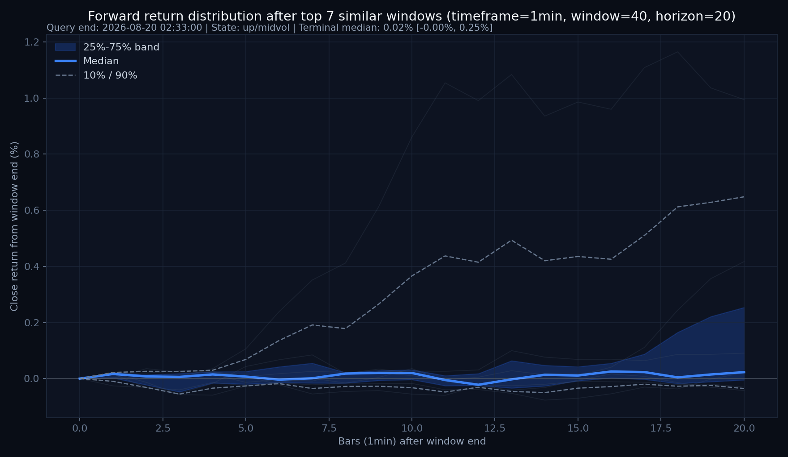 | 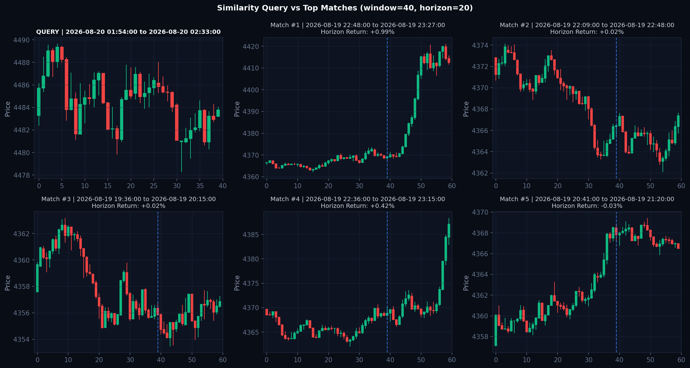 |

### 📈 5min (5m 日内短线) 形态预测与裸 K 对比

| 5min 走势分布概率分位带 (Distribution Ribbon) | 5min Top 相似历史形态裸 K 网格 (Candlestick Grid) |
| :---: | :---: |
| 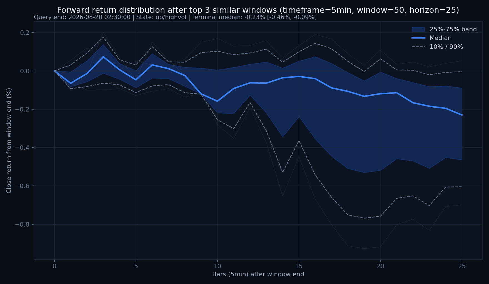 | 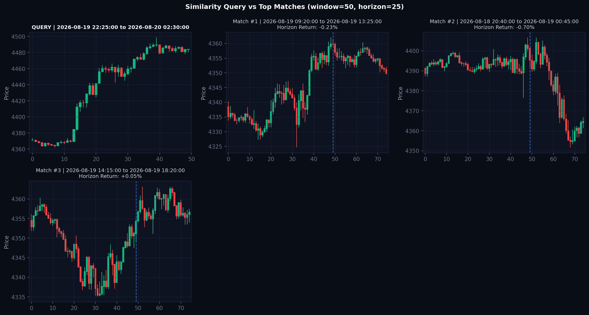 |

### 📈 15min (15m 结构波段) 形态预测与裸 K 对比

| 15min 走势分布概率分位带 (Distribution Ribbon) | 15min Top 相似历史形态裸 K 网格 (Candlestick Grid) |
| :---: | :---: |
| 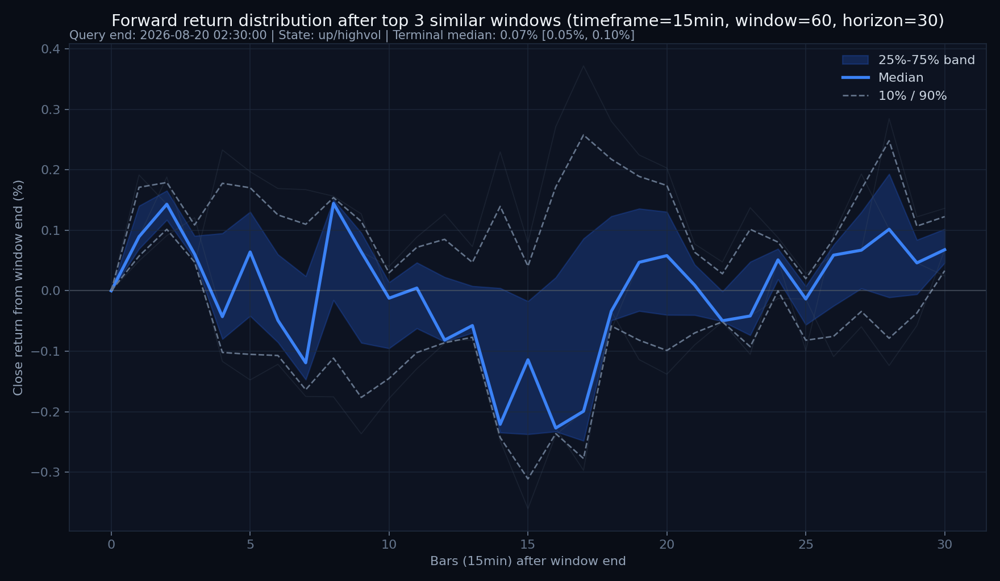 | 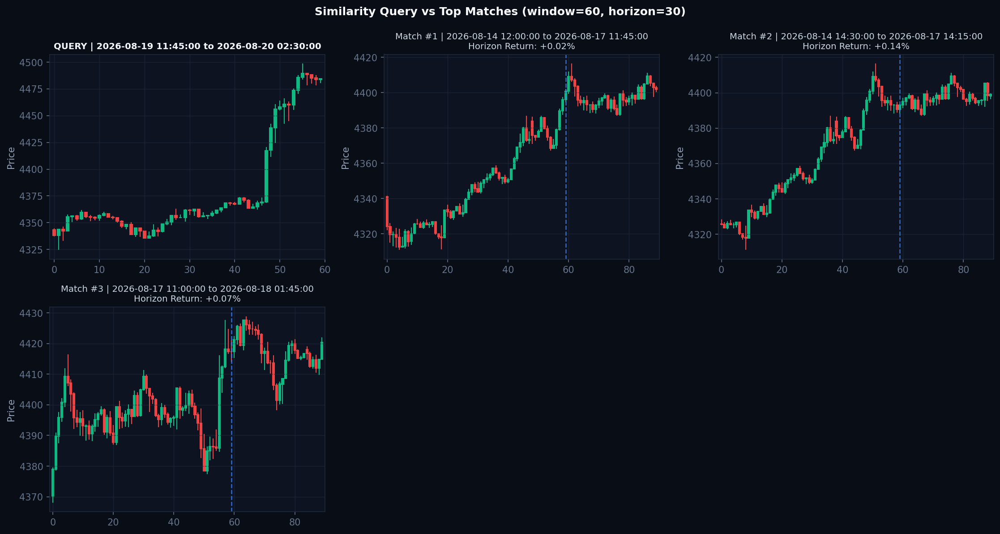 |

### 📈 30min (30m 亚欧盘跨度) 形态预测与裸 K 对比

| 30min 走势分布概率分位带 (Distribution Ribbon) | 30min Top 相似历史形态裸 K 网格 (Candlestick Grid) |
| :---: | :---: |
| 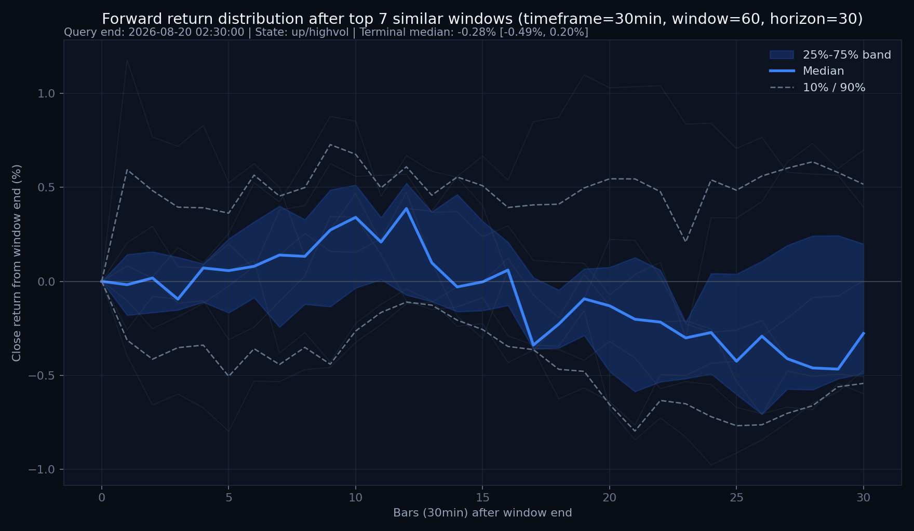 | 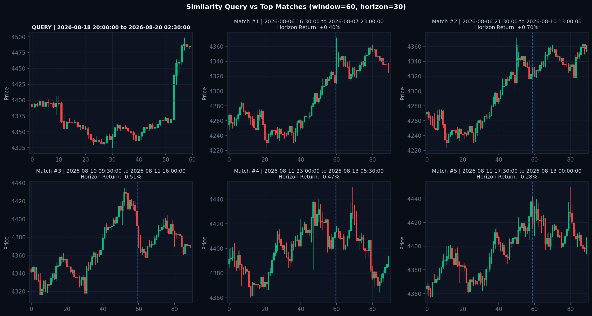 |

### 📈 1h (1h 核心趋势) 形态预测与裸 K 对比

| 1h 走势分布概率分位带 (Distribution Ribbon) | 1h Top 相似历史形态裸 K 网格 (Candlestick Grid) |
| :---: | :---: |
| 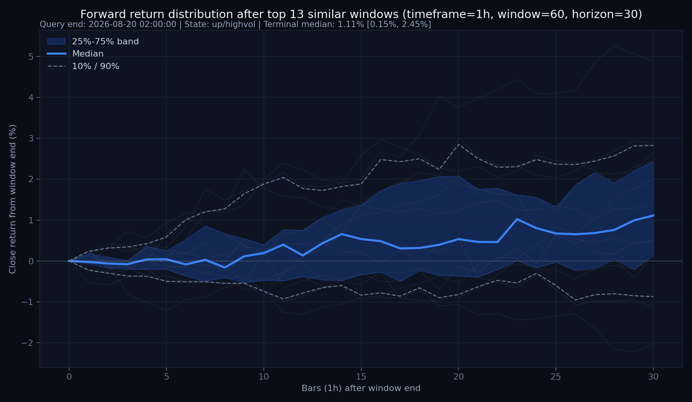 | 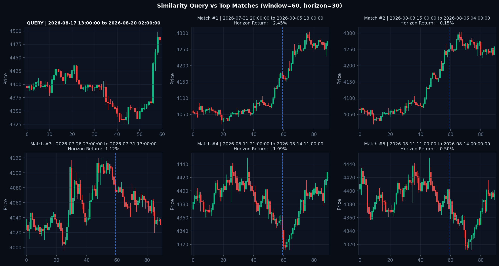 |

### 📈 4h (4h 宏观大级别) 形态预测与裸 K 对比

| 4h 走势分布概率分位带 (Distribution Ribbon) | 4h Top 相似历史形态裸 K 网格 (Candlestick Grid) |
| :---: | :---: |
| 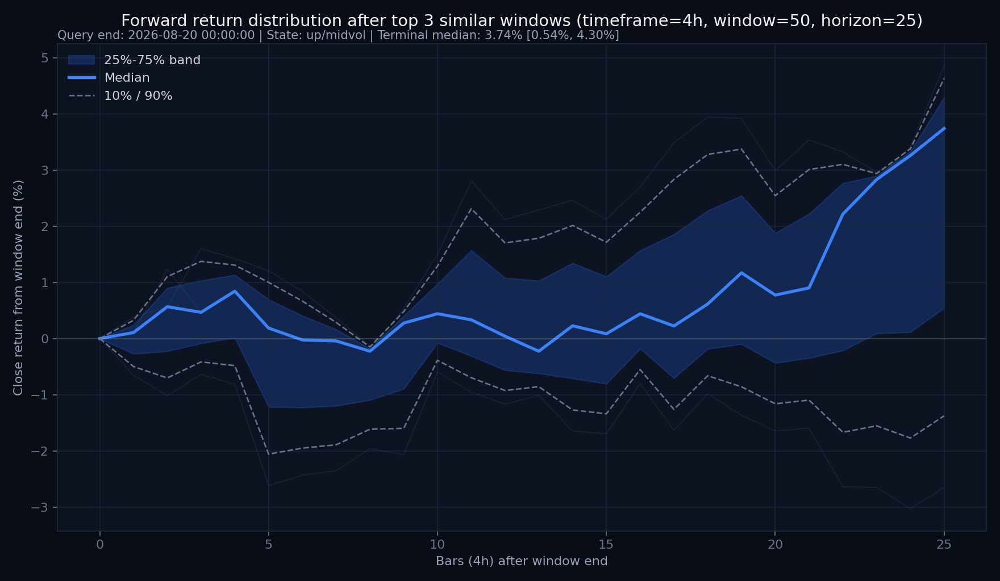 | 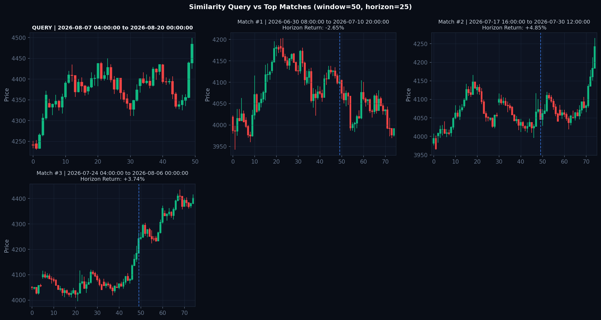 |

### 📈 1d (1d 日线长周期) 形态预测与裸 K 对比

| 1d 走势分布概率分位带 (Distribution Ribbon) | 1d Top 相似历史形态裸 K 网格 (Candlestick Grid) |
| :---: | :---: |
| 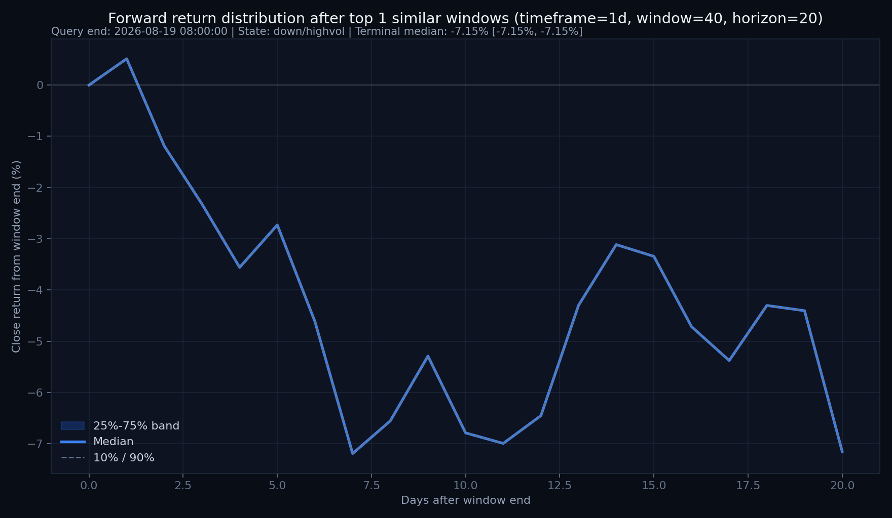 | 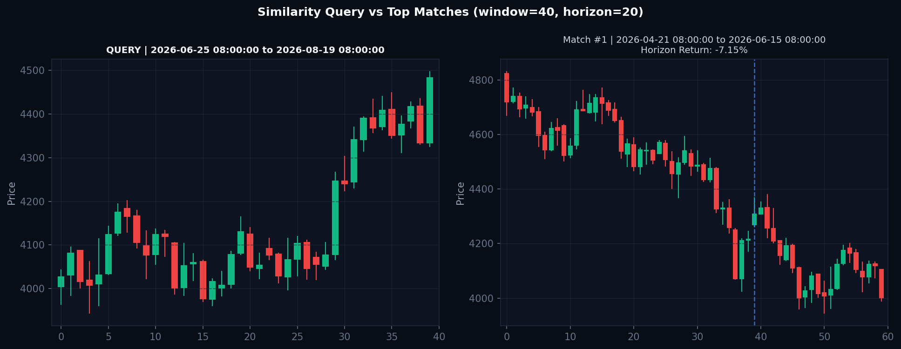 |

